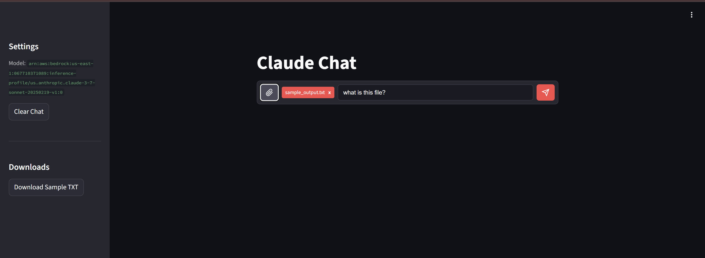
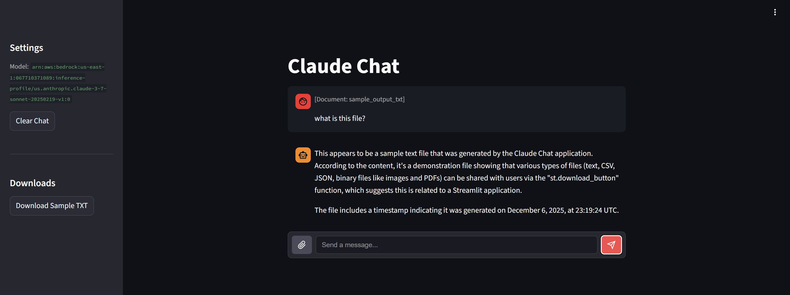

# streamlit-chat-input-fileupload

A Streamlit custom component that extends the standard `st.chat_input` with file upload capability. Drop-in replacement for building chat interfaces that need document and image attachments.





## Features

- Combined text input and file upload in a single component
- Paperclip button for file selection with filename indicator
- Supports images (PNG, JPG, GIF, WebP) and documents (PDF, CSV, TXT, XLSX, DOCX, MD, HTML)
- Auto-detects light/dark theme from Streamlit's settings
- Returns message text and file data (as bytes) in a single dict
- Built with Streamlit Components v2 API

## Installation

```bash
pip install streamlit-chat-input-fileupload
```

## Usage

```python
import streamlit as st
from streamlit_chat_input_fileupload import chat_input_with_upload

user_input = chat_input_with_upload(placeholder="Send a message...")

if user_input:
    st.write(f"Message: {user_input['text']}")

    if user_input["file"]:
        st.write(f"File: {user_input['file']['name']}")
        # user_input["file"]["data"] contains raw bytes
```

## API

### chat_input_with_upload()

```python
chat_input_with_upload(
    placeholder="Send a message...",  # Input placeholder text
    disabled=False,                   # Disable the input
    key=None,                         # Unique component key
)
```

**Returns** `None` or `dict`:
- `text` (str): Message text
- `file` (dict or None): `{name, type, size, data}` where `data` is bytes

### Sending Files to User

Use Streamlit's built-in `st.download_button` to send files back to the user:

```python
import streamlit as st

# Text file
st.download_button(
    label="Download Report",
    data="Report content here",
    file_name="report.txt",
    mime="text/plain",
)

# Binary file (e.g., generated image, PDF)
st.download_button(
    label="Download Image",
    data=image_bytes,
    file_name="output.png",
    mime="image/png",
)

# CSV data
import pandas as pd
df = pd.DataFrame({"col1": [1, 2], "col2": [3, 4]})
st.download_button(
    label="Download CSV",
    data=df.to_csv(index=False),
    file_name="data.csv",
    mime="text/csv",
)
```

## License

MIT
